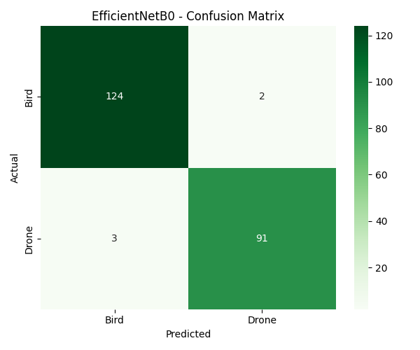
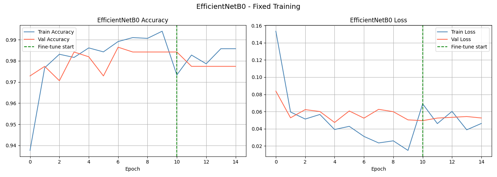
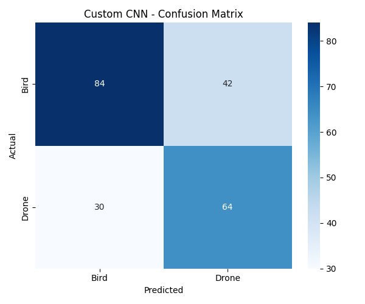

## 📌 Project Overview
This project develops a deep learning solution that classifies 
aerial images into two categories — **Bird** or **Drone** — using 
Custom CNN and Transfer Learning (EfficientNetB0).

The solution helps in security surveillance, wildlife protection, 
and airspace safety where accurate identification between drones 
and birds is critical.

---

## 🎯 Final Results

| Model | Accuracy | Precision | Recall | F1 Score |
|-------|----------|-----------|--------|----------|
| Custom CNN | 67.27% | 60.38% | 68.09% | 64.00% |
| **EfficientNetB0** | **97.73%** | **97.85%** | **96.81%** | **97.33%** |

✅ **EfficientNetB0 selected as best model!**

---

## 📁 Dataset

| Split | Bird | Drone | Total |
|-------|------|-------|-------|
| Train | 1414 | 1248 | 2662 |
| Valid | 217  | 225  | 442  |
| Test  | 126  | 94   | 220  |
| **Total** | | | **3324** |

---

## 🛠️ Tech Stack
- **Language:** Python 3.10
- **Deep Learning:** TensorFlow, Keras
- **Models:** Custom CNN, EfficientNetB0
- **Deployment:** Streamlit
- **Training:** Google Colab (T4 GPU)
- **Libraries:** NumPy, Matplotlib, Seaborn, Scikit-learn

---

## 📓 Project Structure

aerial-object-classification/
├── 01_EDA_Preprocessing.ipynb           # Data exploration & augmentation
├── 02_Custom_CNN.ipynb                  # Custom CNN model
├── 03_Transfer_Learning_EfficientNetB0  # EfficientNetB0 model
├── 04_Streamlit_App.ipynb               # Streamlit deployment
├── app.py                               # Streamlit application
├── requirements.txt                     # Dependencies
└── README.md                            # Project documentation

---

## 🚀 How to Run

### 1. Clone the Repository
```bash
git clone https://github.com/YOUR_USERNAME/aerial-object-classification.git
cd aerial-object-classification
```

### 2. Install Dependencies
```bash
pip install -r requirements.txt
```

### 3. Run Streamlit App
```bash
streamlit run app.py
```

---

## 📊 Model Performance

### EfficientNetB0 Confusion Matrix


### Training History


### Custom CNN Confusion Matrix


---

## 🌍 Real World Use Cases
- 🌿 **Wildlife Protection** — Detect birds near wind farms
- 🔒 **Security & Defense** — Identify drones in restricted airspace
- ✈️ **Airport Safety** — Bird strike prevention
- 🔬 **Environmental Research** — Track bird populations

-----------------------------------------------------------------------------------------
